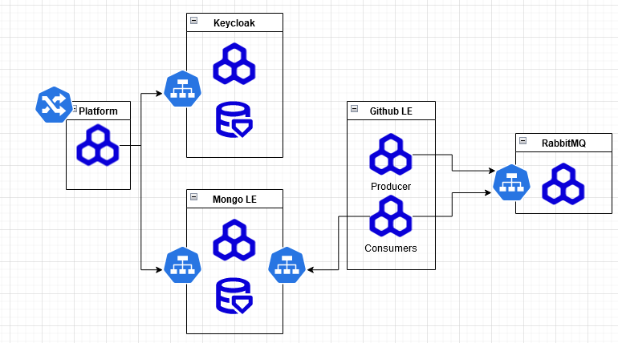

# Secure Sea Platform
---
Dynamic API key inventory and monitoring platform. 

## Descirption
The Secure Sea Patform is meant for large IT teams who levergage 3rd party api keys to inventory their API keys from a central location.

SSP monitors and scans the public web with various leak engines to search high and low for customer secrets that are publily available. 

These results are stored in a database for easy lookup. SSP run 24/7 and ensures that public sources are scanned atleast once every X. 

When a customer integrates their 3rd party services into SSP the platform will automatically conduct a query of the customer's 3rd party API keys and leverage the database of public leaks to find leaked customer credentials. 

## Files

`pub_scraper/main.py`
Queries the github api for all publicly available repo and parses them into a database for further consumption.

`leak_eninges/`
Stores all code for core leak engines. leak engines are stand alone CLI tools. 

`leak_eninges/git`
Git leak engine to monitor both historical and real time public git repos

## Leak Engines
| Name | Description | Sources|
Git | monitors historic and realtime git feeds| github, gitlab, bitbucket
Pastebin
Containers
AMIs / other cloud images

    - public event feeds from git server APIs
    - github, gitlab, bitbucket
Pastebin
    - 
## Architecture
### Initial:

