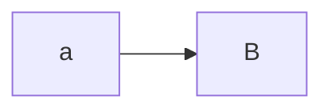

# Secure Sea Platform
---
Dynamic API key inventory and monitoring platform. 

## Descirption
The Secure Sea Patform is meant for large IT teams who levergage 3rd party api keys to inventory their API keys from a central location.

SSP monitors and scans the public web with various leak engines to search high and low for customer secrets that are publily available. 

These results are stored in a database for easy lookup. SSP run 24/7 and ensures that public sources are scanned atleast once every X. 

When a customer integrates their 3rd party services into SSP the platform will automatically conduct a query of the customer's 3rd party API keys and leverage the database of public leaks to find leaked customer credentials. 

## files

`pub_scraper/main.py`
Queries the github api for all publicly available repo and parses them into a database for further consumption.

`leak_engines/trufflehog/th_github/`

`producer.py`
Queries the github event api for recent public events. Pushes any new PushEvent to rabbitMQ. 

`consumer/main.py`
Consumes new events from rabbitmq and exectures trufflehog locally against the recent commits in the PushEvent. Data is pushed to MongoDB

## Data flow

